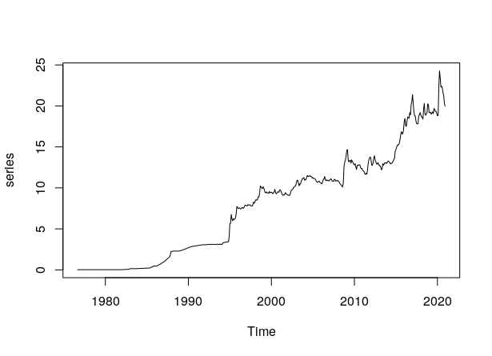

# Serie de tiempo del precio del dolar desde septiembre de 1976 hasta diciembre del 2020

El presente código agrega por mes los datos históricos diarios del precio del dolar desde septiembre de 1976 hasta diciembre del 2020. Los datos usados fueron descargados del <a href="https://www.banxico.org.mx/SieInternet/consultarDirectorioInternetAction.do?sector=6&accion=consultarCuadro&idCuadro=CF373&locale=es">Sistema de Información Económica</a> el 15 de enero de 2021. Aunque los datos originales son desde el año de 1954, es hasta septiembre de 1976 que se tiene un registro real. 

Como resultado se obtiene un data frame, cuyos primeros renglones se muestran a continuación:

```sh
   fechas  promedios
1  1976-9 0.02006000
2 1976-10 0.02071050
3 1976-11 0.02430143
4 1976-12 0.02022273
5  1977-1 0.02074571
6  1977-2 0.02254200
```

Además, se obtiene la gráfica de la serie de tiempo, como se muestra a continuación:


